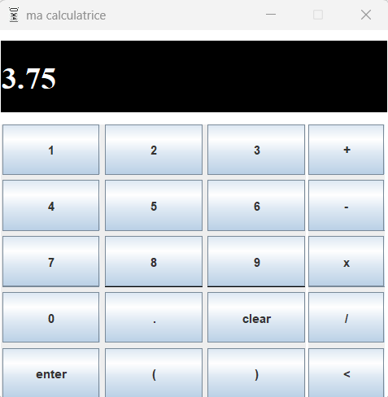

# calculatrice en Java avec Maven, Junit  

Calculatrice simple, avec gestion des règles de priorité des opérations, y compris les parenthèses.  

Le .jar est l'exécutable java (java SE-17). Les tests JUnit ne sont pas livrés.

